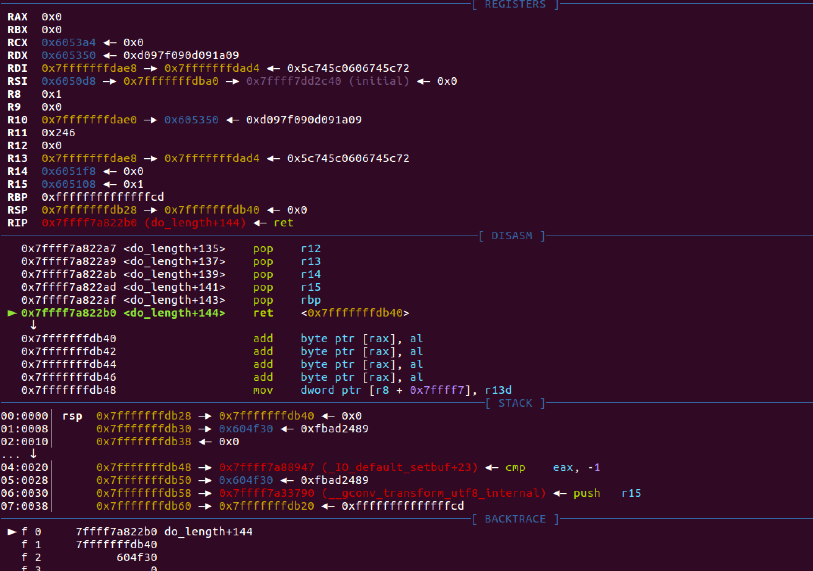
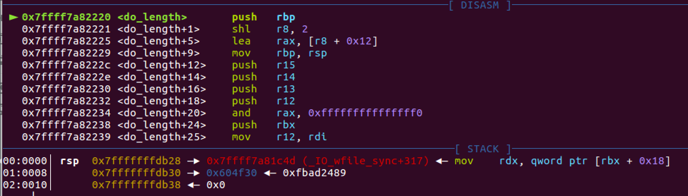
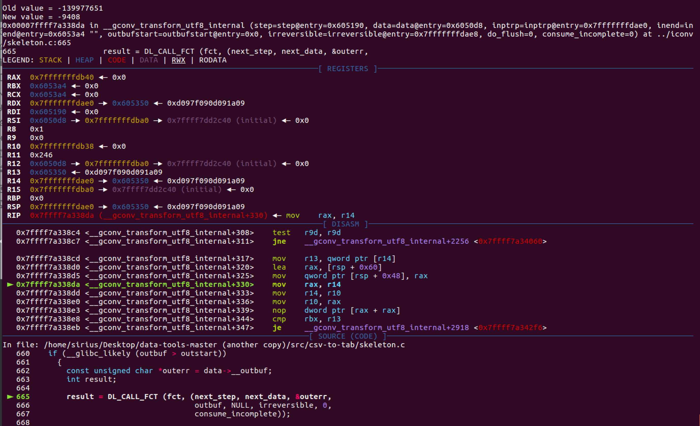

# Readme.md

When I fuzz the [program](https://github.com/CCCCCrash/POCs/blob/master/Bin/System-glibc-2.23/csv_to_tab.c)) , I found a crash occurred in glibc.

> Linux lambda 4.15.0-36-generic #39~16.04.1-Ubuntu SMP Tue Sep 25 08:59:23 UTC 2018 x86_64 x86_64 x86_64 GNU/Linux  
> Distributor ID:	Ubuntu  
> Description:	Ubuntu 16.04.5 LTS  
> Release:	16.04  
> Codename:	xenial  
> glibc: 2.23  

It will write 8 bytes at [rax], but rax is 0x0.so, this is a OOB write.

I did some research.when the function `do_length`finished, it will return to *(0x7fffffffdb28)=0x7fffffffdb40, and there full with 0s.

When call `do_length`, the return address is 0x7ffff7a81c4d, and it was stored in 0x7fffffffdb28.so what happened?

rax is rsp + 0x60, and then mov rax to  *(rsp + 0x48), this operation midify the ret address

