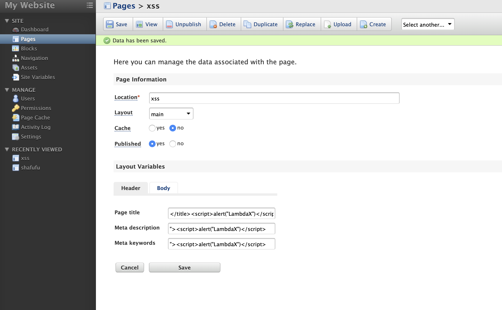
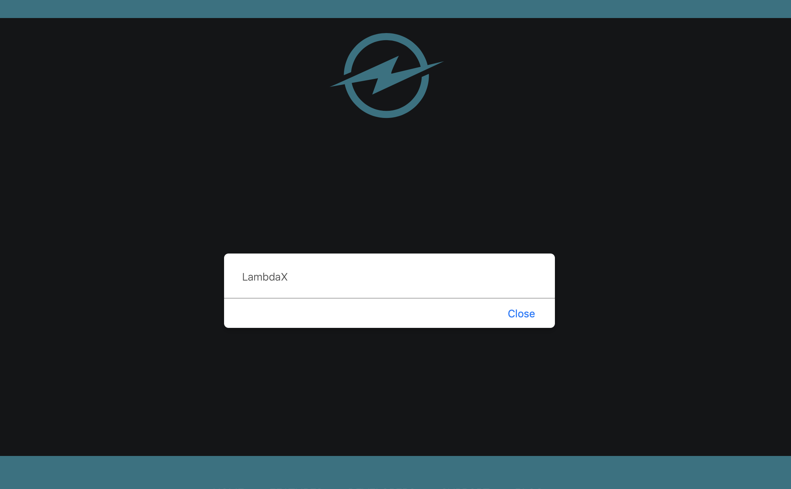

when set up this cms, we should active the admin.

after the, login, and create a new page. 

http://IP/fuel/pages/edit/1?lang=english

the Page title、Meta description、Meta keywords are all vulnability

  

  

payload: `</title>`,`">`

