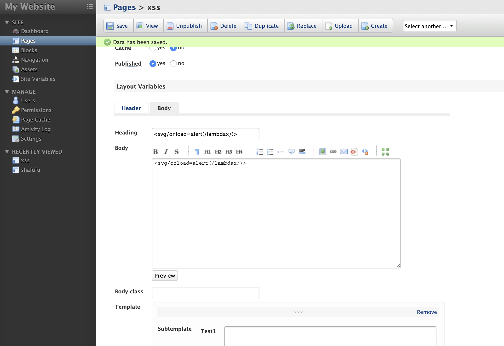
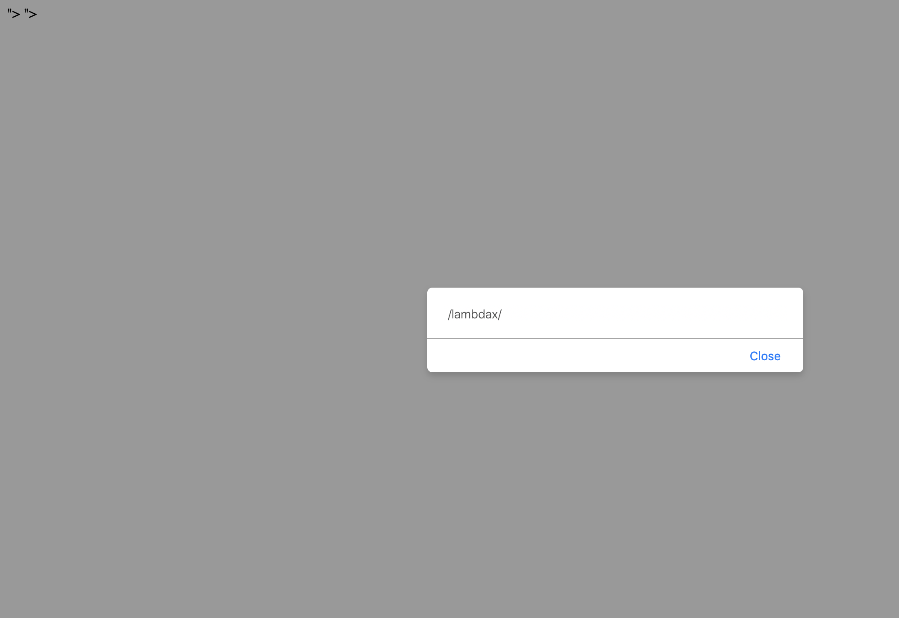

when set up this cms, we should active the admin.

after the, login, and create a new page. 

http://IP/fuel/pages/edit/1?lang=english

in the Layout Variables, we choose Body

the Heading、Body are all vulnability

  

  

payload: `<svg/onload=alert(/lambdax/)>`