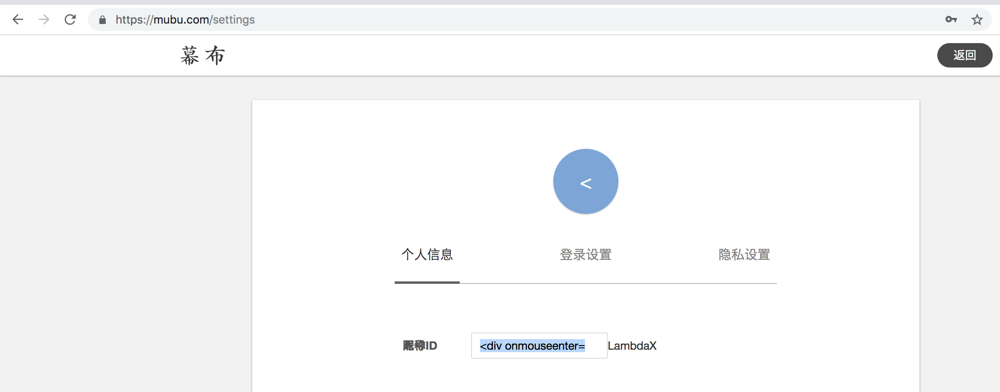
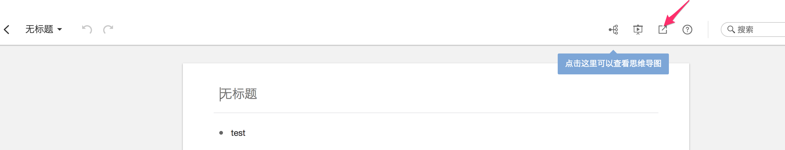
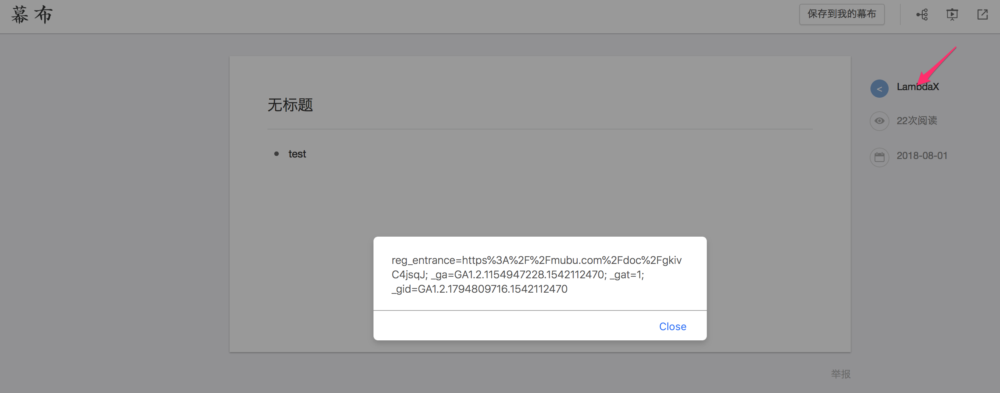

I set the name with malicious code, such as `
LambdaX
`

Then i create a new note and share it with others

click the share button to produce a url: https://mubu.com/doc/gkivC4jsqJ

if someone open the url, and move the mouse to my username, then it will be pop a window

