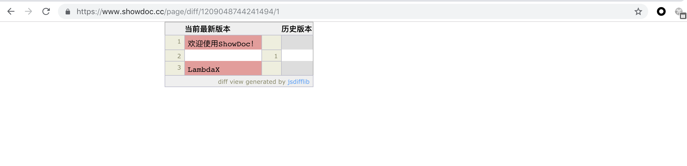

The access control is not configured correctly.User's note can be read by others no matter who.

PoC:
ps: all projects are not use password to protect.

#### 0x01 Read

I resisted two users in two browsers separately:kk123 and kk1234.

Then I recorded some thing use kk1234:

 

As showed in the url, this note was alloced a page_id.

Next, I login as user kk123, change my page_id to 1209048744241494, I'll read kk1234's note

 

Another page reveals information also.

 

If I user burp suite, I will see more information such as user's name

#### 0x02 Modify

